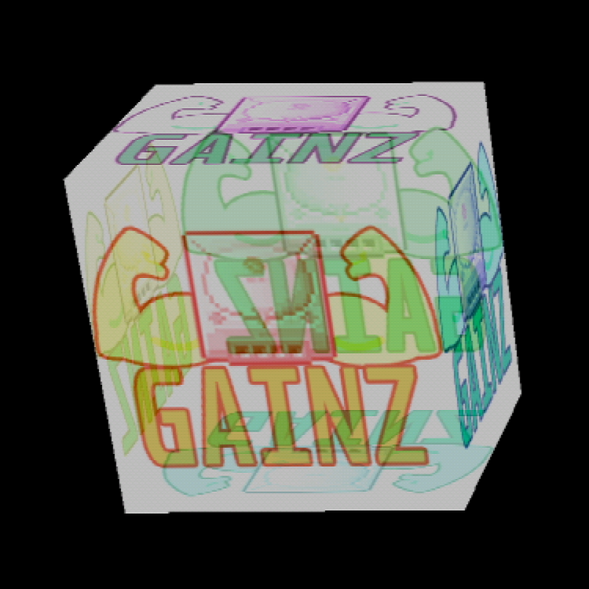

# sprites_of_sh4zam

This is intended to be an example of how to apply the magic of [sh4zam](https://github.com/gyrovorbis/sh4zam) in your Dreamcast projects.

## Current Status
I've ported my previous spritecube example to use the c23 #embed feature for texture assets instead of the classical romdisk and sh4zam for 3d transformations. I'm struggling a little with setting the perspective matrix up correctly. What is there renders polygons to the screen, but not completely as intended. 

Once I figure the perspective matrix stuff out, I'm very much looking forwards to adding ligthning to the demo, as it would be a waste not to dive into that part of sh4zam also. I believe that further gainz can be had by using the normal calculations of the lightning process to discard half of the sprites before submitting to the PVR chip. 

## Requirements 
- A dreamcast toolchain with KallistoOS and a gcc version > 1.5.0 (for the #embed stuff). Instructions for setting that up [can be found here](https://dreamcast.wiki/Getting_Started_with_Dreamcast_development). Make sure to set the gcc version correctly in the [Configuring the dc-chain script](https://dreamcast.wiki/Getting_Started_with_Dreamcast_development#Configuring_the_dc-chain_script) step.
- sh4zam installed on top your KallistoOS toolchain, [as per these instructions][https://github.com/gyrovorbis/sh4zam?tab=readme-ov-file#make-kallistios].
- The ability to help me get the perspective matrix right (j/k)